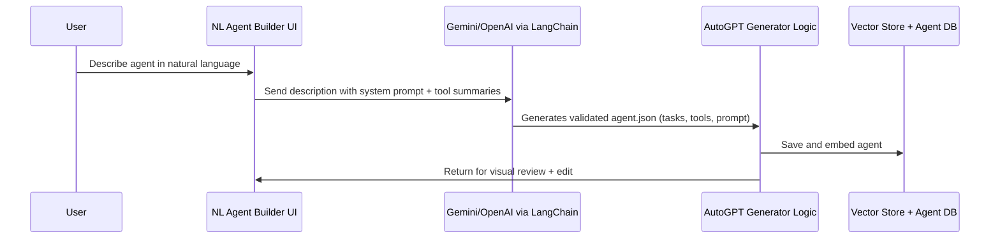
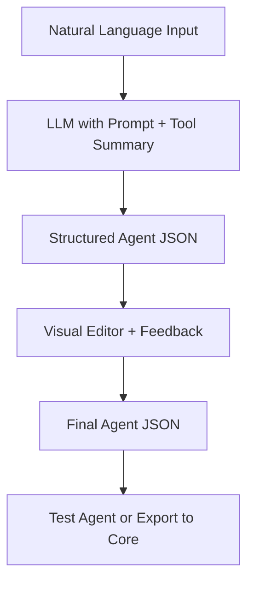

# 🧠 Natural Language Agent/Workflow Builder

Build powerful agents and workflows **using plain language**. This builder lets users describe their goals in natural language and instantly generate fully structured, testable agents without needing to write JSON or touch low-level logic.

---

<!-- ## 🎯 Purpose

Designed to **streamline agent creation**, this system bridges the gap between **human-friendly goal descriptions** and **machine-readable configurations** (`agent.json`). It's ideal for:

- Builders of agentic workflows
- Automation teams who want to rapidly prototype and iterate  
- Users seeking to abstract away tool orchestration and task decomposition

--- -->

## 🔗 Target Users & Platforms

- **No-code/Low-code users** (e.g., Zapier/IFTTT-style audience)  
- **Agent developers**
- **Teams building agent-based products** in enterprise AI, operations, research, or marketing automation

---

## 🚀 Key Features

- **Natural Language to Agent JSON**: Input plain English, get structured `agent.json`
- **Auto Tool Selection**: Picks compatible tools and fills in required schemas
- **Agent Personality & Prompt Design**: Crafts system prompts and memory config automatically
- **Visual Canvas Integration**: Syncs output to a visual editor for review and refinement
- **Feedback Loop**: Users can revise the generated tasks and guide improvements
- **Multi-Language Input**: Supports non-English agent descriptions
- **Template Suggestions**: Recognizes common intents and suggests agent templates

---

## ⚙️ Architecture Overview

### 🛠 Creation Flow



---

### 🔩 Implementation Diagram



---

## 🧠 Example Agent Descriptions

### 🧑‍💼 Sales Outreach Agent

**Input**:  
> "Create an agent that finds LinkedIn profiles, enriches them with emails, and drafts personalized cold emails."

**Generated Output**:
- `tools`: ApolloSearchBlock, ProxycurlEnrichmentBlock, LLMEmailWriterBlock
- `systemPrompt`: Configured with sales tone, personalization emphasis
- `tasks`: 4-step sequence with memory setup and enrichment loop

---

### 📈 Market Research Agent

**Input**:  
> "Build an agent that tracks competitor news, summarizes insights, and stores them in Notion."

**Output**:
- WebSearchBlock + FileSummarizerBlock  
- ExportToNotionBlock  
- Agent system prompt tailored to trend analysis

---

## ✨ Advanced Features

### 🧩 Tool Auto-Mapping

The LLM understands tool constraints (input/output schemas, auth, limits) and matches natural intent to compatible tools. If a required function isn’t supported, it suggests:

> ❌ *"This goal can't be fully accomplished using the current toolset. Try: 'Summarize uploaded PDFs instead of real-time web scraping.'"*

---

### 🧠 Decomposition + Revision Loop

Users can:
- View subtasks in a friendly editable textbox
- Give refinement instructions (e.g., “Add filtering step before export”)
- Revert to original, or compare LLM vs user-edited

---

### 🌐 Multi-Language Support

Agent generation works in any input language. Examples:

```
EN: “Create a content scheduler for LinkedIn + Twitter.”
ES: “Crea un planificador de contenido para redes sociales.”
JA: “ソーシャルメディアの投稿をスケジュールするエージェントを作成してください。”
```

---

## 📦 System Prompt Template (LangChain)

```ts
const systemPrompt = {
  role: "You are an expert AutoGPT agent architect.",
  task: "Generate a complete agent.json with subtasks, memory, prompt, and tools.",
  tools: blockSummaries,  // injected summaries from blocks.json
  constraints: "Use only valid tools. Respect input/output schema.",
  outputFormat: {
    name: "string",
    description: "string",
    systemPrompt: "string",
    tasks: [{ id, name, blockName, inputs }],
    memory: { enabled: true, keys: [] }
  }
};
```

---

## 🗓 Development Timeline

| Phase                        | Status      | Notes |
|-----------------------------|-------------|-------|
| Prompt & Decomposer Design  | ✅ Complete | Includes tool-based task planning |
| Agent JSON Validation Layer | ✅ Complete | Schema checks + fallbacks |
| Feedback Loop UI            | ✅ Complete | Editable textbox + revision |
| Multi-Example Retrieval     | ✅ Complete | Few-shot grounding with vector search |
| Visual Integration (Streamlit) | 🛠 In Progress | Canvas + sidebar controls |
| Pattern Memory & RAG Assist | 🔜 Planned  | Retrieve successful past agents to improve outputs |

---

## 🔮 Coming Soon

- **Multi-Agent Workflows**: Generate collaborative agents from high-level tasks
- **Template Memory**: Recommend similar past agents and reuse config
- **Block-by-Block Debugging**: Stepwise preview + explanation of tool usage
- **Self-healing Agents**: Suggest alternative blocks if one fails

---

## ✅ Benefits

- **Accessible**: Anyone can describe agents — no JSON or technical knowledge required  
- **Fast**: Go from idea to deployable agent in minutes  
- **Refinable**: Mix natural input with visual UI for collaborative iteration  
- **Smart**: Guided by block schemas and best-practice prompt engineering  
- **Reusable**: Agent templates and memory-based RAG enable continual improvement
