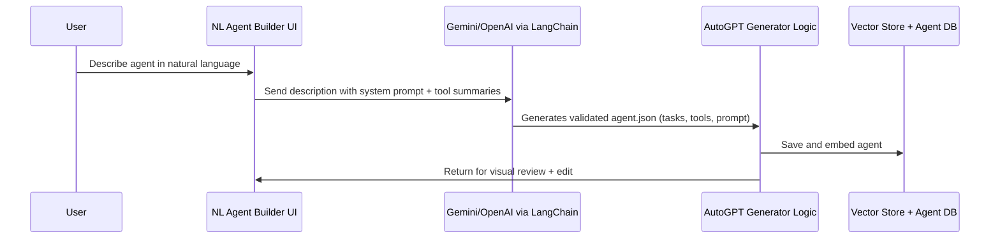
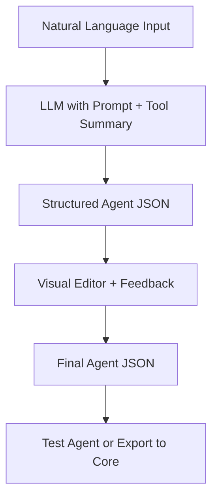

# 🧠 Natural Language Agent/Workflow Builder

[](https://www.python.org/downloads/)
[](https://opensource.org/licenses/MIT)
[](https://streamlit.io)
[](https://langchain.com)
[](https://github.com/psf/black)

Build powerful AI agents and workflows **using plain language**. This production-ready system lets you describe your goals in natural language and instantly generates fully structured, testable agents—no JSON or code required.


## ⚡ Quick Start

Get started in 3 simple steps:

```bash
# 1️⃣ Install dependencies
pip install -r requirements.txt

# 2️⃣ Configure API keys
cp .env.example .env
# Edit .env with your OpenAI or Google API key

# 3️⃣ Launch the app
python run.py
```

🎉 **That's it!** Your browser will open automatically. Start creating agents with simple descriptions!

📖 **[5-Minute Quickstart →](QUICKSTART.md)** | **[Full Setup Guide →](SETUP.md)** | **[Usage Guide →](USAGE.md)**

---

## 🎬 What Can You Build?

<table>
<tr>
<td width="33%">

### 📧 Sales Automation
*"Find LinkedIn profiles, enrich with emails, draft personalized outreach"*

✅ Lead generation  
✅ Email personalization  
✅ Outreach automation

</td>
<td width="33%">

### 📊 Market Intelligence
*"Monitor competitors, analyze trends, export insights to Notion"*

✅ Competitor tracking  
✅ Sentiment analysis  
✅ Automated reporting

</td>
<td width="33%">

### 📱 Social Media
*"Generate engaging posts, schedule on LinkedIn & Twitter"*

✅ Content generation  
✅ Multi-platform posting  
✅ Optimal timing

</td>
</tr>
</table>

**See [examples/](examples/) for complete agent configurations →**

---

## 🔗 Target Users & Platforms

- **No-code/Low-code users** (e.g., Zapier/IFTTT-style audience)  
- **Agent developers**
- **Teams building agent-based products** in enterprise AI, operations, research, or marketing automation

---

## 🚀 Key Features

- **Natural Language to Agent JSON**: Input plain English, get structured `agent.json`
- **Auto Tool Selection**: Picks compatible tools and fills in required schemas
- **Agent Personality & Prompt Design**: Crafts system prompts and memory config automatically
- **Visual Canvas Integration**: Syncs output to a visual editor for review and refinement
- **Feedback Loop**: Users can revise the generated tasks and guide improvements
- **Multi-Language Input**: Supports non-English agent descriptions
- **Template Suggestions**: Recognizes common intents and suggests agent templates

---

## ⚙️ Architecture Overview

### 🛠 Creation Flow



---

### 🔩 Implementation Diagram



---

## 🧠 Example Agent Descriptions

### 🧑‍💼 Sales Outreach Agent

**Input**:  
> "Create an agent that finds LinkedIn profiles, enriches them with emails, and drafts personalized cold emails."

**Generated Output**:
- `tools`: ApolloSearchBlock, ProxycurlEnrichmentBlock, LLMEmailWriterBlock
- `systemPrompt`: Configured with sales tone, personalization emphasis
- `tasks`: 4-step sequence with memory setup and enrichment loop

---

### 📈 Market Research Agent

**Input**:  
> "Build an agent that tracks competitor news, summarizes insights, and stores them in Notion."

**Output**:
- WebSearchBlock + FileSummarizerBlock  
- ExportToNotionBlock  
- Agent system prompt tailored to trend analysis

---

## ✨ Advanced Features

### 🧩 Tool Auto-Mapping

The LLM understands tool constraints (input/output schemas, auth, limits) and matches natural intent to compatible tools. If a required function isn’t supported, it suggests:

> ❌ *"This goal can't be fully accomplished using the current toolset. Try: 'Summarize uploaded PDFs instead of real-time web scraping.'"*

---

### 🧠 Decomposition + Revision Loop

Users can:
- View subtasks in a friendly editable textbox
- Give refinement instructions (e.g., “Add filtering step before export”)
- Revert to original, or compare LLM vs user-edited

---

### 🌐 Multi-Language Support

Agent generation works in any input language. Examples:

```
EN: “Create a content scheduler for LinkedIn + Twitter.”
ES: “Crea un planificador de contenido para redes sociales.”
JA: “ソーシャルメディアの投稿をスケジュールするエージェントを作成してください。”
```

---

## 📦 System Prompt Template (LangChain)

```ts
const systemPrompt = {
  role: "You are an expert AutoGPT agent architect.",
  task: "Generate a complete agent.json with subtasks, memory, prompt, and tools.",
  tools: blockSummaries,  // injected summaries from blocks.json
  constraints: "Use only valid tools. Respect input/output schema.",
  outputFormat: {
    name: "string",
    description: "string",
    systemPrompt: "string",
    tasks: [{ id, name, blockName, inputs }],
    memory: { enabled: true, keys: [] }
  }
};
```

---

## 🗓 Development Timeline

| Phase                        | Status      | Notes |
|-----------------------------|-------------|-------|
| Prompt & Decomposer Design  | ✅ Complete | Includes tool-based task planning |
| Agent JSON Validation Layer | ✅ Complete | Schema checks + fallbacks |
| Feedback Loop UI            | ✅ Complete | Editable textbox + revision |
| Multi-Example Retrieval     | ✅ Complete | Few-shot grounding with vector search |
| Visual Integration (Streamlit) | 🛠 In Progress | Canvas + sidebar controls |
| Pattern Memory & RAG Assist | 🔜 Planned  | Retrieve successful past agents to improve outputs |

---

## 📁 Project Structure

```
Natural-Language-Agent-Workflow-Builder/
├── app.py                      # Streamlit UI application
├── run.py                      # Quick start launcher
├── requirements.txt            # Python dependencies
├── .env.example               # Environment configuration template
├── SETUP.md                   # Detailed setup instructions
│
├── src/                       # Core application code
│   ├── agent_generator.py     # Agent generation logic
│   ├── llm_client.py         # LLM provider integration
│   ├── blocks.py             # Tool/block management
│   ├── templates.py          # Template system
│   └── config.py             # Configuration management
│
├── config/                    # Configuration files
│   ├── blocks.json           # Available tools/blocks
│   └── templates.json        # Agent templates
│
├── examples/                  # Example agent configurations
│   ├── sales_outreach_example.json
│   ├── market_research_example.json
│   └── social_media_manager_example.json
│
├── tests/                     # Unit tests
│   ├── test_blocks.py
│   ├── test_templates.py
│   └── test_agent_generator.py
│
└── generated_agents/          # Your created agents (auto-generated)
```

## 🎯 Usage Examples

### Example 1: Natural Language Creation

```text
Input: "Create an agent that finds LinkedIn profiles, 
        enriches them with emails, and drafts personalized cold emails"

Output: Complete agent with:
  ✓ ApolloSearchBlock for LinkedIn search
  ✓ ProxycurlEnrichmentBlock for email finding
  ✓ LLMEmailWriterBlock for personalized drafts
  ✓ Professional sales system prompt
  ✓ Memory tracking for contacted profiles
```

### Example 2: Template-Based Creation

Choose from pre-built templates:
- 📧 **Sales Outreach Agent** - Lead generation and email outreach
- 📊 **Market Research Agent** - Competitor monitoring and insights
- 📱 **Social Media Manager** - Content creation and scheduling

### Example 3: Refinement Loop

```text
1. Generate initial agent
2. Review tasks and configuration
3. Refine: "Add a filtering step before export"
4. Get updated agent with new task
```

## 🔧 Available Tools/Blocks

The system includes 10+ pre-configured blocks:

| Block | Category | Use Case |
|-------|----------|----------|
| WebSearchBlock | Data Collection | Search the web for information |
| LLMTextGenerationBlock | Generation | Generate text with AI |
| LLMEmailWriterBlock | Generation | Draft personalized emails |
| ApolloSearchBlock | Data Collection | Search LinkedIn profiles |
| ProxycurlEnrichmentBlock | Enrichment | Enrich with emails/data |
| FileSummarizerBlock | Processing | Summarize documents |
| ExportToNotionBlock | Integration | Export to Notion |
| ContentSchedulerBlock | Automation | Schedule social media |
| SentimentAnalysisBlock | Analysis | Analyze text sentiment |
| DataFilterBlock | Processing | Filter and transform data |

## 🧪 Testing

Run the test suite:

```bash
# Run all tests
pytest tests/

# Run specific test file
pytest tests/test_blocks.py

# Run with coverage
pytest --cov=src tests/
```

## 🔮 Coming Soon

- **Multi-Agent Workflows**: Generate collaborative agents from high-level tasks
- **Template Memory**: Recommend similar past agents and reuse config
- **Block-by-Block Debugging**: Stepwise preview + explanation of tool usage
- **Self-healing Agents**: Suggest alternative blocks if one fails
- **Docker Support**: Easy deployment with containers
- **API Endpoint**: RESTful API for programmatic agent generation

## ✅ Benefits

- **Accessible**: Anyone can describe agents — no JSON or technical knowledge required  
- **Fast**: Go from idea to deployable agent in minutes  
- **Refinable**: Mix natural input with visual UI for collaborative iteration  
- **Smart**: Guided by block schemas and best-practice prompt engineering  
- **Reusable**: Agent templates and memory-based RAG enable continual improvement
- **Production-Ready**: Full validation, error handling, and testing

## 🤝 Contributing

Contributions welcome! Areas for contribution:
- Additional tool/block integrations
- New agent templates
- UI/UX improvements
- Documentation and examples
- Test coverage

## 📄 License

MIT License - feel free to use in your projects!

## 🙏 Acknowledgments

Built with:
- [LangChain](https://langchain.com/) - LLM orchestration
- [Streamlit](https://streamlit.io/) - Beautiful web UI
- [Pydantic](https://pydantic.dev/) - Data validation
- OpenAI GPT-4 / Google Gemini - AI capabilities

---

**Ready to build your first agent? [Start here →](SETUP.md)**
